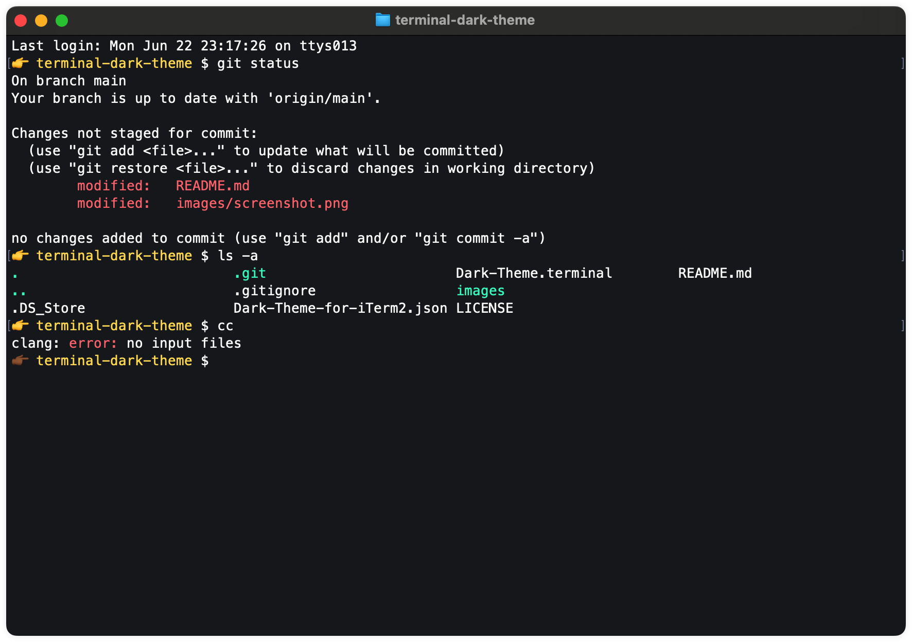

# Terminal Dark Theme

> A dark theme for macOS Terminal.app and iTerm2



## 📥 Download

**Install with Git**

```shell
$ git clone https://github.com/tofrankie/terminal-dark-theme.git
```

**Install manually**

Download the [ZIP archive](https://github.com/tofrankie/terminal-dark-theme/archive/refs/heads/main.zip) and extract it

## ⚙️ Importing Profiles

### Terminal.app

1. Open Terminal → Settings → Profiles
2. Click the `Action` pop-up menu, then choose `Import`
3. Select the `Dark-Theme.terminal` file
4. Select `Dark Theme`, then click `Default`

### iTerm2

1. Open iTerm2 → Settings → Profiles
2. Click `Other Actions...`, then choose `Import JSON Profiles...`
3. Select the `Dark-Theme-for-iTerm2.json` file
4. Select `Dark Theme`, then click `Set as Default`

## 🎨 ANSI Color Palette

| Palette    | Hex       | Alpha | 🧪                                                             |
| :--------- | :-------- | :---- | :------------------------------------------------------------- |
| Background | `#1C1F24` | `1`   |  |
| Text       | `#FEFEFD` | `1`   |  |
| Bold Text  | `#FEFEFD` | `1`   |  |
| Selection  | `#4774F6` | `0.5` |   |
| Black      | `#1D1E24` | `1`   |       |
| Red        | `#FF6767` | `1`   |         |
| Green      | `#57BF9C` | `1`   |       |
| Yellow     | `#F8D36B` | `1`   |      |
| Blue       | `#65A1F8` | `1`   |        |
| Magenta    | `#D85888` | `1`   |     |
| Cyan       | `#6AE3B9` | `1`   |        |
| White      | `#FEFEFD` | `1`   |       |

## 📄 License

MIT License © [Frankie](https://github.com/tofrankie)
